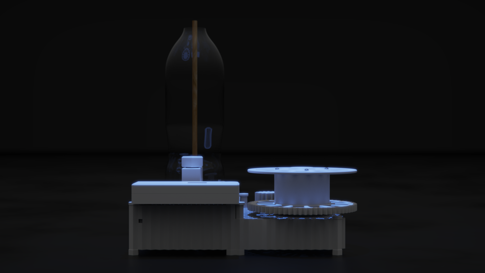
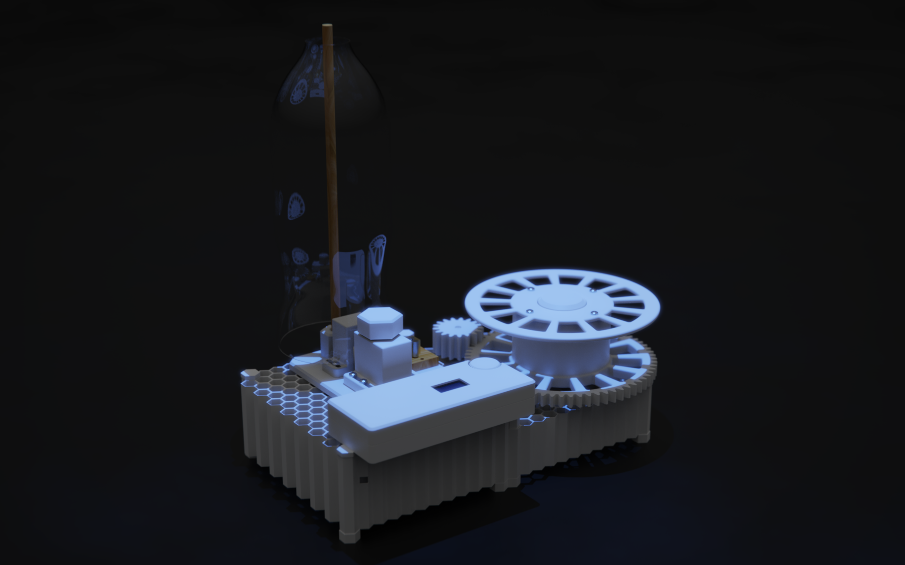
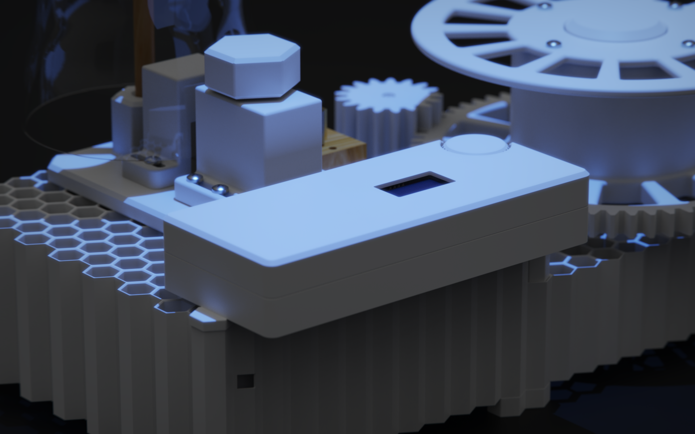
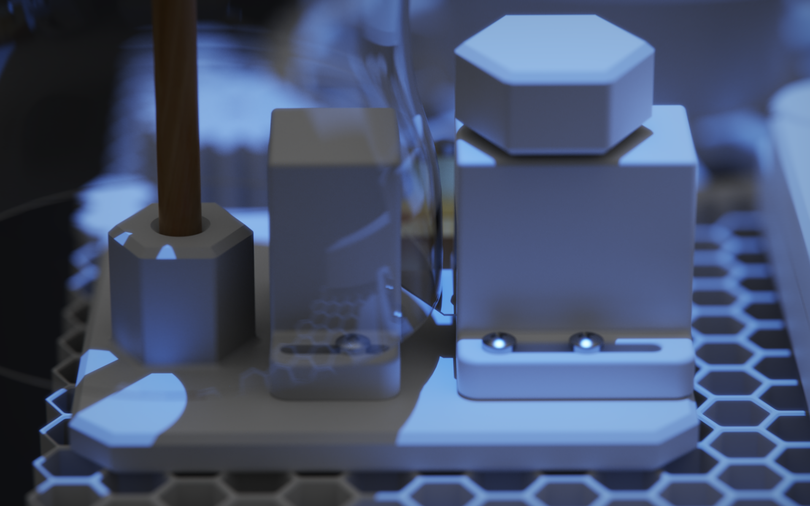
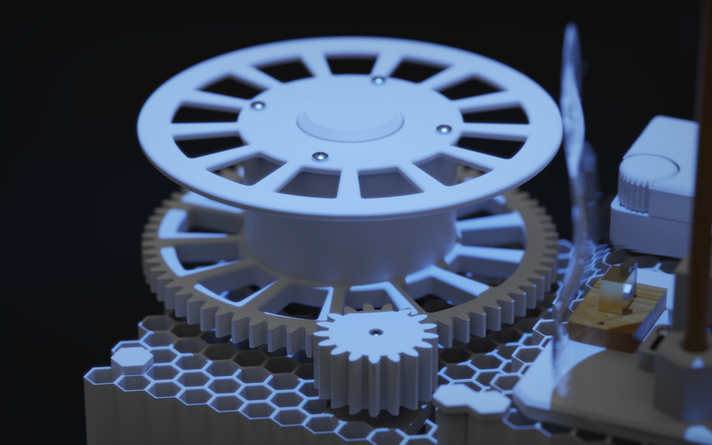
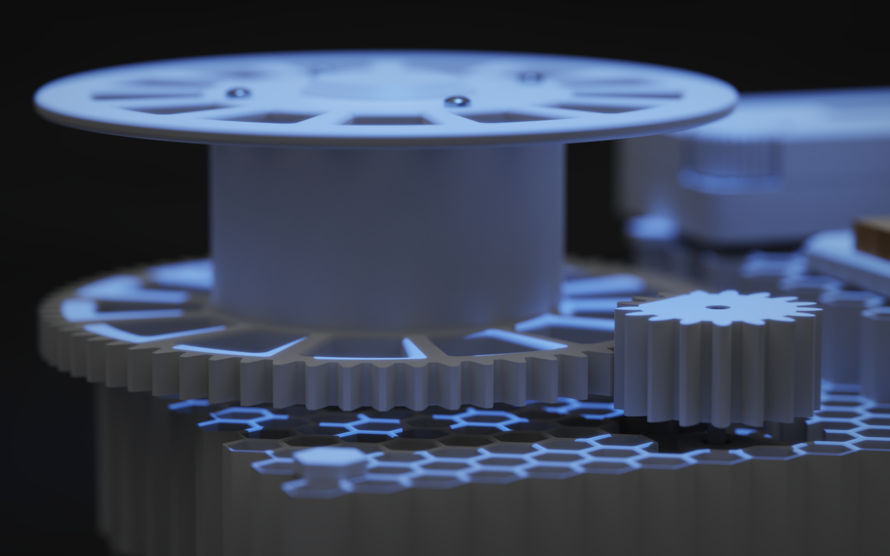
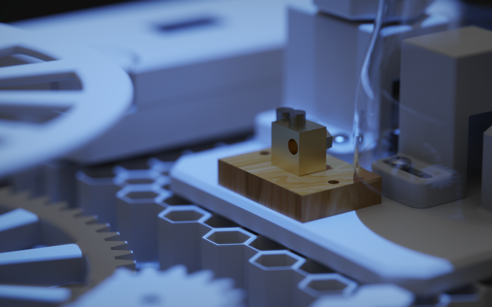

# Filament Recycling Project

A complete open-source plastic bottle-to-3D-printer-filament recycling machine, encompassing mechanical design, electrical design, and embedded firmware. The system heats, extrudes, and spools recycled plastic into usable 3D printing filament using a custom-built machine controlled by an ESP32-C6 microcontroller.

---

## Gallery









---

## Table of Contents

- [Overview](#overview)
- [Features](#features)
- [Project Structure](#project-structure)
- [Hardware Components](#hardware-components)
- [Firmware](#firmware)
  - [Menu System](#menu-system)
  - [Pin Configuration](#pin-configuration)
  - [PID Temperature Control](#pid-temperature-control)
- [Mechanical Design](#mechanical-design)
  - [Cutting Mechanism](#cutting-mechanism)
  - [Gear Train](#gear-train)
  - [Spool Assembly](#spool-assembly)
  - [Electrical Enclosure](#electrical-enclosure)
  - [Production Phases](#production-phases)
- [Build & Flash](#build--flash)
- [Usage](#usage)
- [License](#license)

---

## Overview

This project converts plastic bottles into 3D printer filament through a process of cutting, heating, extruding, and spooling. The machine is driven by a stepper motor controlled through a TB6600 driver, with a heated extruder regulated by a PID controller reading a MAX6675 thermocouple. All user interaction is handled through a rotary encoder and a 128×64 SH1106 OLED display.

## Features

- **PID-controlled heated extruder** with closed-loop (PID) and open-loop (fixed power) modes
- **Stepper motor control** with configurable speed (0–100%) and microstepping (1, 2, 4, 8, 16, 32)
- **MAX6675 thermocouple** for real-time temperature monitoring (up to 250 °C)
- **128×64 SH1106 OLED display** with animated splash screen, scrollable menus, progress bars, and icons
- **Rotary encoder navigation** with acceleration-aware input for fast/slow value adjustment
- **Non-Volatile Storage (NVS)** — all settings (temperature, speed, PID gains, pin assignments) persist across power cycles with flash-wear-optimized writes
- **Fully configurable GPIO pins** — reassign stepper, heater, and thermocouple pins from the on-device menu
- **Time-proportional heater control** (1 Hz software PWM) for proportional power output without hardware PWM
- **4-phase 3D-printable mechanical design** with full SolidWorks source files

---

## Project Structure

```
fillamentRecyclingProject/
├── README.md
├── ElectricalDesign/                  # Electrical schematics & PCB designs
├── fillamentRecyclingProjectCode/     # ESP32-C6 firmware (ESP-IDF + PlatformIO)
│   ├── CMakeLists.txt
│   ├── platformio.ini                 # PlatformIO config (ESP32-C6-DevKitM-1)
│   ├── sdkconfig.esp32-c6-devkitm-1
│   ├── include/
│   ├── lib/
│   ├── src/
│   │   ├── main.c                     # Application entry point, menu system, control loop
│   │   ├── sh1106.c / sh1106.h        # SH1106 OLED display driver (I2C)
│   │   └── AiEsp32RotaryEncoder.c/.h  # Rotary encoder driver (ESP-IDF port)
│   └── test/
└── MechanicalDesign/                  # SolidWorks CAD files
    ├── MainAssembly.SLDASM            # Top-level assembly
    ├── baseAssembly.SLDASM            # Base frame assembly
    ├── spoolAssembly.SLDASM           # Spool winding assembly
    ├── electricalBoxAssembly.SLDASM   # Electronics enclosure assembly
    ├── CuttingMechanism/              # Bottle cutting sub-assembly
    ├── ProductionDocuments/           # 3D-print-ready STLs & build guides (Phase 1–4)
    └── ReferenceFiles/                # Vendor CAD models & datasheets
```

---

## Hardware Components

| Component | Description |
|---|---|
| **ESP32-C6-DevKitM-1** | Main microcontroller (RISC-V, Wi-Fi 6, BLE 5) |
| **SH1106 128×64 OLED** | I2C display (address 0x3C) for user interface |
| **HW-040 Rotary Encoder** | Navigation input with push-button |
| **TB6600 Stepper Driver** | Drives the extruder/spool stepper motor |
| **MAX6675 + K-Type Thermocouple** | Temperature sensing for the hotend (bit-banged SPI) |
| **Heater Cartridge** | Hotend heating element (time-proportional control) |
| **SMPS Power Supply** | Main power source |
| **BTS7960 Motor Driver** | Reference motor driver (in reference files) |
| **Bearings** | SKF 6008 (25×47×16 mm) and 63005-2RS1 |
| **Flexible Coupling (5×5 mm)** | Motor-to-shaft coupler |
| **Spur Gears** | 15T, 17T, and 67T gear train for speed reduction |

---

## Firmware

The firmware is written in **C** using the **ESP-IDF** framework and managed via **PlatformIO**.

### Menu System

The OLED display presents a hierarchical menu navigated entirely via the rotary encoder:

```
SPLASH (animated loading screen, 2 seconds)
└── MAIN MENU
    ├── Start/View Process  → RUN screen (live temp, motor speed, elapsed time, progress bar)
    │                         └── Confirm Stop dialog
    ├── Temperature         → Slider (30–250 °C, speed-adaptive steps: 1/5/10/20)
    ├── Motor Speed         → Slider (0–100%)
    ├── Microstep           → Selector (1/1, 1/2, 1/4, 1/8, 1/16, 1/32)
    ├── Hotend Mode         → Closed Loop (PID) / Open Loop (fixed %)
    │   └── Heater Power    → Slider (0–100%, open-loop only)
    ├── PID Settings
    │   ├── Kp (0.0–10.0)
    │   ├── Ki (0.0–5.0)
    │   └── Kd (0.0–10.0)
    └── Pin Settings        → Reassign all 7 GPIO pins (0–21)
```

### Pin Configuration

Default GPIO assignments (all configurable via the on-device menu):

| Function | Default GPIO |
|---|---|
| I2C SCL | 20 |
| I2C SDA | 19 |
| Encoder A | 15 |
| Encoder B | 18 |
| Encoder Button | 14 |
| Stepper STEP | 4 |
| Stepper DIR | 5 |
| Stepper ENABLE | 6 |
| Heater | 7 |
| MAX6675 CLK | 10 |
| MAX6675 CS | 11 |
| MAX6675 DO | 12 |

### PID Temperature Control

The closed-loop temperature controller implements:

- **Proportional, Integral, Derivative** control with configurable gains
- **Derivative-on-measurement** (avoids setpoint kick on temperature changes)
- **Anti-windup** clamping on the integral term (±100)
- **Time-proportional output** — a 1-second window where the heater is on for `(pid_output / 100) × 1000 ms`
- Temperature sampled every 250 ms from the MAX6675 (respecting the sensor's ~220 ms conversion time)

---

## Mechanical Design

All CAD files are in **SolidWorks** format (.SLDPRT for parts, .SLDASM for assemblies).

### Cutting Mechanism

Located in `MechanicalDesign/CuttingMechanism/`:

- **Blade & Blade Holder** — upper and lower holders secure the cutting blade
- **Blade Housing** — enclosed cutting chamber
- **Bottle Base & Size Adjustor** — accommodates different bottle diameters
- **Height Adjustment Screws** — fine-tune blade position
- **Metal Rod** — structural support for the cutting assembly

### Gear Train

Three spur gears provide mechanical advantage for the extrusion process:

- **15T Spur Gear** — driver gear
- **17T Spur Gear** — intermediate gear
- **67T Spur Gear** — driven gear (high torque output)

### Spool Assembly

- **Filament Spool** (2 variants) — collects the finished filament
- **Spool Plate** — mounting plate for the spool
- **Coupler** — connects motor shaft to spool mechanism
- **Knob** — manual spool adjustment

### Electrical Enclosure

- **Electrical Box** + **Lid** — houses the ESP32, motor driver, and power supply
- **Mount Stand** — secures the enclosure to the base

### Base Frame

- **Base** (standard and hex variants) — machine foundation
- **Base Feet & Double Joiner Feet** — anti-vibration feet
- **Base Joiner** — connects base sections
- **Bearing Mount** — supports rotating shafts (SKF 6008 / 63005-2RS1)
- **Fasteners** (1× and 4× variants) — structural fasteners

### Production Phases

The build is organized into 4 print phases under `MechanicalDesign/ProductionDocuments/`:

| Phase | Parts (STL files) | Description |
|---|---|---|
| **Phase 1** | Base, Blade Holder, Blade Housing, Height Adjustment Screws, Size Adjustor | Cutting mechanism & base plate |
| **Phase 2** | Base (×3), Base Feet (×2), Base Joiner, Double Joiner Feet, Fasteners (×2) | Frame structure & assembly |
| **Phase 3** | Bearing Mount, Electrical Box & Lid, Fasteners, Knob, Mount Stand, Spool, Spool Plate, Spur Gear | Enclosure, spool, and drive train |
| **Phase 4** | Blade Holder, Spur Gear | Final assembly parts |

Each phase includes a PDF/DOCX build guide.

---

## Build & Flash

### Prerequisites

- [PlatformIO](https://platformio.org/) (VS Code extension or CLI)
- ESP32-C6-DevKitM-1 board
- USB-C cable

### Steps

```bash
# Clone the repository
git clone <repository-url>
cd fillamentRecyclingProject/fillamentRecyclingProjectCode

# Build the firmware
pio run -e esp32-c6-devkitm-1

# Flash to the board
pio run -e esp32-c6-devkitm-1 --target upload

# Monitor serial output
pio device monitor
```

---

## Usage

1. **Power on** — the OLED displays an animated splash screen with a recycling logo.
2. **Navigate** — rotate the encoder to scroll through menu items; click to select.
3. **Configure** — set temperature (30–250 °C), motor speed, microstepping, hotend mode, and PID gains.
4. **Start** — select "Start Process" to enable the heater and motor. The run screen shows live temperature, target, heater power %, motor speed, elapsed time, and a temperature progress bar.
5. **Stop** — select "STOP" on the run screen or long-press the encoder (1 second) from the main menu. A confirmation dialog prevents accidental shutdowns.
6. **Settings persist** — all parameters are saved to flash automatically and restored on next boot.

---

## License

This project is licensed under the MIT License - see the [LICENSE](LICENSE) file for details.

Copyright (c) 2026 Rahat Khan Siyad

The rotary encoder library is based on [ai-esp32-rotary-encoder](https://github.com/igorantolic/ai-esp32-rotary-encoder) by Igor Antolic (MIT License).
